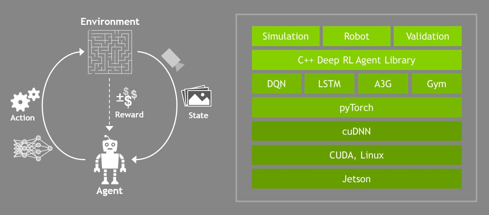
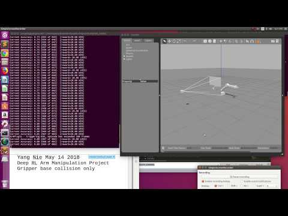

# Udacity Term 2 Deep Reinforcement Learning Arm Manipulation Project

### Abstract

This project needs to use Deep Reinforcement Learning technology to train an Robotic Arm Manipulation.
The goal is to create a DQN agent and define reward functions to teach a robotic arm to carry out two primary objectives:
    1. Have any part of the robot arm touch the object of interest, with at least a 90% accuracy.
    2. Have only the gripper base of the robot arm touch the object, with at least a 80% accuracy.
 For both objectives, the results were presented in this article.

### Introduction 

This project used a Gazebo environment to build a 3D Robotic Arm Manipulator model and used C++ language to develop the Plugin code.

There are three main components to this gazebo file, which define the environment:
    ​ The robotic arm with a gripper attached to it.
    ​ A camera sensor, to capture images to feed into the DQN.
    ​ A cylindrical object or **prop**.

#### Arm Plugin
The robotic arm model, found in the gazebo-arm.world file, calls upon a gazebo plugin called the ArmPlugin. This plugin is responsible for creating the DQN agent and training it to learn to touch the prop. The gazebo plugin shared object file, libgazeboArmPlugin.so, attached to the robot model in gazebo-arm.world, is responsible for integrating the simulation environment with the RL agent. The plugin is defined in the ArmPlugin.cpp file, also located in the gazebo folder.

### Background / Formulation

​         

#### Data Acquisition:

#### Model creation:

##### The parameter setting:  

### Results

After implementing the code and adjusting the hyperparameters, the network achieved the required objectives.

    1. Have any part of the robot arm touch the object of interest, with at least a 90% accuracy.

    2. Have only the gripper base of the robot arm touch the object, with at least a 80% accuracy.

|  Item Name  | Any part of Arm | Gripper Base |
| ------------ | :----------: | :-----------: |
| Touched prop | 67 | 359 | 
| Total Run | 83 | 401 | 
| Percentage | 81% | 90% |

### Conclusion 

### Future Work

1. Install Nvidia DIGITS system on local PC instead of using cloud GPU resource, the way is no time limitation to implement and test different projects and models.
2.  Deploying the model  and package on Jetson TX2 board and testing them again.

### References

[1] S. Perkins, A. Walker and E. Wolfart, Classification "https://homepages.inf.ed.ac.uk/rbf/HIPR2/classify.htm" 2003

[2] Nvidia, DIGITS workflow "https://developer.nvidia.com/digits" 2018

[3] Marcus D. Bloice, Augmentor "https://github.com/mdbloice/Augmentor" 2018

[4] Siddharth Das, CNNs Architectures:LeNet, AlexNet, VGG, GoogLeNet, ResNet and more …  "https://medium.com/@siddharthdas_32104/cnns-architectures-lenet-alexnet-vgg-googlenet-resnet-and-more-666091488df5" 2017